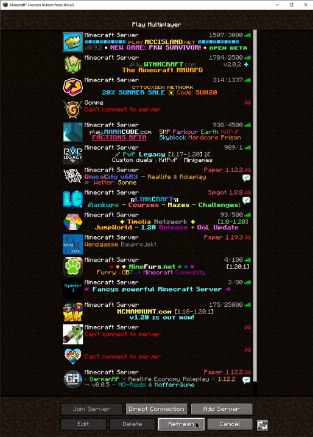
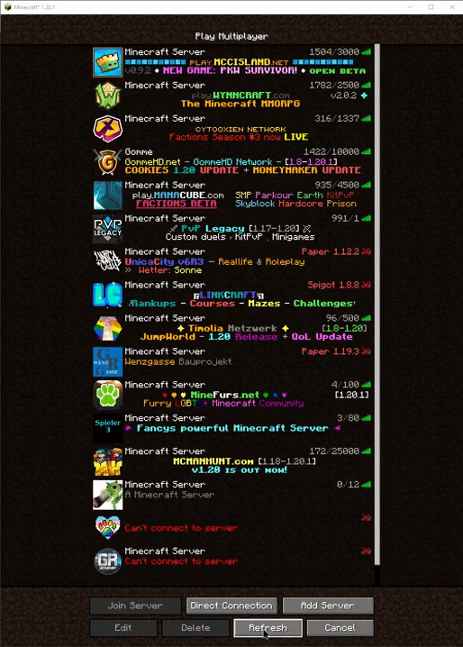

# Server Pinger Fixer

This mod improves how servers in the multiplayer list are pinged, making for a much nicer experience in the menu. You can especially notice the difference when pressing the refresh button a lot. 

The mod works by increasing the Thread count used for pinging servers. It also clears the Thread pool when it's overloaded.

| Without the Mod                                                                                            | With the Mod                                                                                                |
|------------------------------------------------------------------------------------------------------------|-------------------------------------------------------------------------------------------------------------|
| Gets stuck loading after just a few times  pressing the refresh button                                 | Loads even when spamming the refresh button                                                                 |
|  |  |

 

Inspired by: https://github.com/Nixuge/ServerlistBufferFixer
